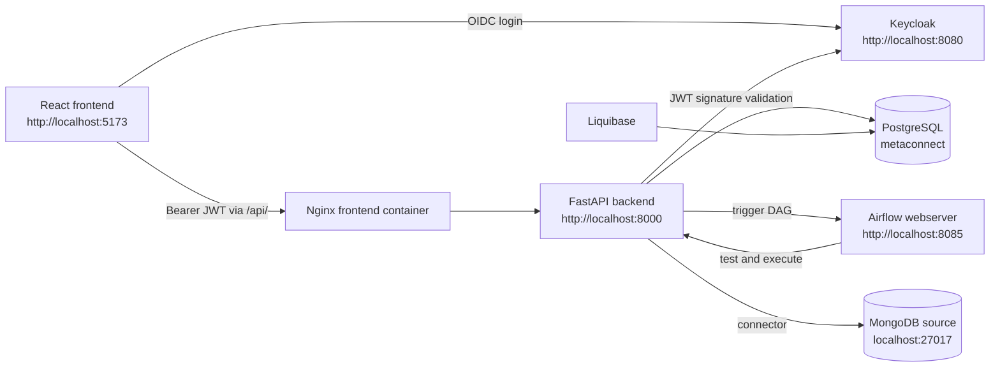
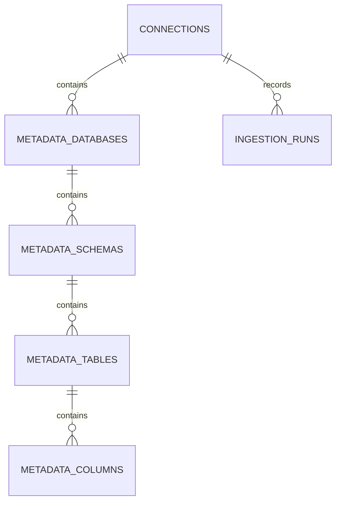
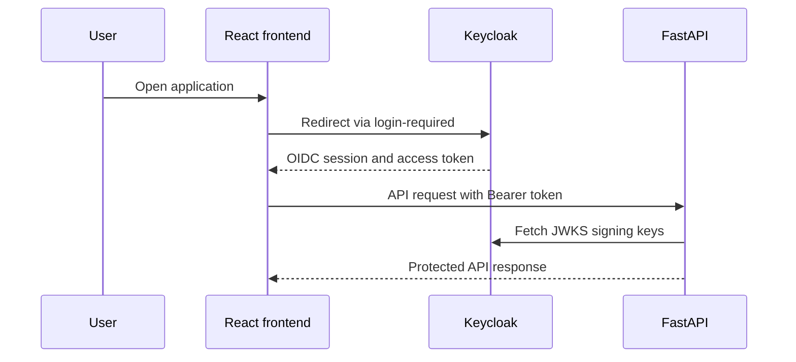

# MetaConnect

**A metadata management platform for registering data sources, ingesting schema metadata, and exploring a unified catalog.**

MetaConnect is a Dockerized application that lets authenticated users register MongoDB connections, verify connectivity, trigger on-demand metadata ingestion through Apache Airflow, and browse or search the resulting catalog. The backend is built with FastAPI and PostgreSQL; the frontend is a React single-page application served by Nginx; Keycloak provides authentication and JWT validation.

## Project Overview

MetaConnect addresses a common data-platform problem: connection details and schema information are often scattered across systems and difficult to inspect consistently. The application creates a normalized catalog hierarchy:

```text
Connection -> Database -> Schema -> Table/Collection -> Column/Field
```

The current connector implementation targets MongoDB. During ingestion, it discovers accessible databases, represents MongoDB's schema-free model with a synthetic `default` schema, records collections as tables, and infers document fields from sampled documents. PostgreSQL stores the normalized catalog and ingestion history so the React frontend can display dashboards, connection status, metadata trees, and search results.

## Key Features

- **Keycloak-hosted login** using the `metaconnect` realm and React Keycloak adapter.
- **Connection management** for creating, viewing, editing, deleting, and filtering registered connections.
- **Connection verification** before a new connection can be saved in the frontend.
- **Encrypted stored passwords** using Fernet; API responses expose only `has_password`.
- **MongoDB connector** with host/port configuration, optional credentials, and custom connection URI support.
- **On-demand Airflow ingestion** that validates a connection, extracts metadata, and persists it in PostgreSQL.
- **Metadata explorer** with a hierarchical connection/database/schema/table/column view.
- **Global metadata search** across connection, database, schema, table/collection, and column/field names.
- **Dashboard statistics** for connections, databases, schemas, tables, columns, and ingestion runs.
- **Ingestion history** with status, Airflow state, timestamps, errors, and statistics.
- **OpenAPI documentation** through FastAPI Swagger UI and ReDoc.
- **Docker Compose environment** containing PostgreSQL, Liquibase, Keycloak, MongoDB, Airflow, FastAPI, and the React/Nginx frontend.

## Technology Stack

| Category | Technology | Purpose |
|---|---|---|
| Frontend | React 18, Vite, React Router 6 | Single-page interface and protected page routing |
| UI | Lucide React, custom CSS | Icons, controls, dashboards, tables, explorer, and light theme |
| Authentication | Keycloak 24.0.1, `keycloak-js` | Hosted login, SSO session, and OIDC tokens |
| Backend | Python 3.11, FastAPI, Uvicorn | REST API, validation, business logic, and OpenAPI docs |
| Persistence | PostgreSQL 16, SQLAlchemy 2 | Application data, normalized metadata, and ingestion history |
| Migrations | Liquibase 4.26 | Initial PostgreSQL schema creation |
| Source connector | PyMongo 4.6 | MongoDB connectivity, discovery, and schema inference |
| Credential security | `cryptography` Fernet | Encryption/decryption of saved connection passwords |
| JWT validation | `python-jose`, Keycloak JWKS | Backend signature verification for protected routes |
| Orchestration | Apache Airflow 2.8.2, LocalExecutor | On-demand ingestion workflow |
| Reverse proxy | Nginx | Serves the frontend and proxies `/api/` to FastAPI |
| Testing dependencies | pytest, pytest-asyncio | Installed backend test tooling; no project test files currently exist |

## System Architecture



### Request and ingestion flow

1. A user opens the React application.
2. `keycloak-js` uses `login-required` and redirects unauthenticated users to Keycloak.
3. The frontend keeps the current access token in the Keycloak client instance and adds it to protected API requests as `Authorization: Bearer <token>`.
4. FastAPI validates the token signature using Keycloak's JWKS endpoint.
5. Connection creation and metadata operations are stored in PostgreSQL.
6. When ingestion is triggered, the backend creates an ingestion run and starts the Airflow DAG.
7. Airflow tests the saved connection, then calls the backend ingestion execution endpoint.
8. The backend decrypts the saved credential, uses the MongoDB connector, and synchronizes discovered metadata into PostgreSQL.

## Project Structure

```text
Capstone Astra/
├── docker-compose.yml
├── MetaConnect.postman_collection.json
├── README.md
├── .env                         # Local overrides; not committed
├── airflow/
│   ├── Dockerfile
│   └── dags/
│       └── metadata_ingestion_dag.py
├── backend/
│   ├── Dockerfile
│   ├── requirements.txt
│   └── app/
│       ├── main.py
│       ├── api/v1/              # FastAPI route modules
│       ├── connectors/           # Connector abstraction and MongoDB implementation
│       ├── core/                 # Settings, database session, and security
│       ├── models/               # SQLAlchemy entities
│       ├── schemas/              # Pydantic request/response models
│       └── services/             # Connection, metadata, search, and Airflow logic
├── db/
│   ├── liquibase.properties
│   └── changelog/
│       ├── db.changelog-master.yaml
│       └── changeset/001-initial-schema.sql
├── frontend/
│   ├── Dockerfile
│   ├── nginx.conf
│   ├── package.json
│   ├── package-lock.json
│   └── src/
│       ├── App.jsx
│       ├── index.css
│       ├── main.jsx
│       ├── components/
│       ├── pages/
│       └── services/
└── keycloak/
    └── realm-export.json
```

Important frontend pages are `DashboardPage`, `ConnectionsPage`, `MetadataExplorerPage`, `IngestionHistoryPage`, and `SearchPage`. `frontend/dist` is generated build output and is not source code.

## Prerequisites

The supported development path uses Docker Compose.

- Docker Desktop with Docker Compose v2.
- Git.
- At least the ports `5173`, `8000`, `8080`, `8085`, `5432`, and `27017` available.
- For non-Docker development: Python 3.11, Node.js/npm, and access to PostgreSQL, Keycloak, Airflow, and MongoDB services.
- A browser with JavaScript enabled.

## Quick Start with Docker Compose

From the repository root:

```powershell
docker compose up --build
```

This builds the backend, frontend, and Airflow images, starts PostgreSQL and MongoDB, imports the Keycloak realm, runs Liquibase, initializes Airflow, and starts the application services.

Open:

| Service | URL |
|---|---|
| MetaConnect frontend | <http://localhost:5173> |
| FastAPI Swagger UI | <http://localhost:8000/docs> |
| FastAPI ReDoc | <http://localhost:8000/redoc> |
| FastAPI health | <http://localhost:8000/health> |
| Keycloak | <http://localhost:8080> |
| Airflow | <http://localhost:8085> |
| Backend root status | <http://localhost:8000/> |

The realm is imported from `keycloak/realm-export.json`. Development account values are defined in that file; do not reuse them in production.

Useful commands:

```powershell
# Start in the background
docker compose up -d --build

# View service status
docker compose ps

# Follow logs for one service
docker compose logs -f backend

# Stop containers but keep named volumes
docker compose down

# Stop containers and delete development database/source volumes
docker compose down -v

# Restart a changed service
docker compose restart backend
```

## Environment Variables

There is no committed `.env.example` file. Backend settings are loaded from `.env` when running outside Compose, while Compose values are declared directly in `docker-compose.yml`.

Create a local `.env` only when overriding defaults:

```dotenv
DATABASE_URL=postgresql://postgres:<password>@localhost:5432/metaconnect
ENCRYPTION_KEY=<fernet-key>
KEYCLOAK_URL=http://localhost:8080
KEYCLOAK_REALM=metaconnect
AIRFLOW_BASE_URL=http://localhost:8085
AIRFLOW_USERNAME=<airflow-user>
AIRFLOW_PASSWORD=<airflow-password>
```

| Variable | Description | Required? | Default or Compose value |
|---|---|---:|---|
| `PROJECT_NAME` | FastAPI project name | No | `MetaConnect API` |
| `API_V1_STR` | API prefix | No | `/api/v1` |
| `DATABASE_URL` | PostgreSQL SQLAlchemy URL | No | Local default in `config.py`; Compose points to `postgres` |
| `ENCRYPTION_KEY` | Fernet key for saved connection passwords | No in code, required for secure deployment | Development fallback exists; replace it |
| `KEYCLOAK_URL` | Keycloak base URL | No | `http://localhost:8080`; Compose uses `http://keycloak:8080` |
| `KEYCLOAK_REALM` | Keycloak realm | No | `metaconnect` |
| `AIRFLOW_BASE_URL` | Airflow webserver URL | No | `http://localhost:8085`; Compose uses `http://airflow-webserver:8080` |
| `AIRFLOW_USERNAME` | Airflow API username | No | `admin` |
| `AIRFLOW_PASSWORD` | Airflow API password | No | `admin` |
| `AIRFLOW_DAG_ID` | Ingestion DAG ID | No | `metadata_ingestion_pipeline` |
| `CORS_ORIGINS` | Allowed CORS origins | No | Local origins plus `*` |
| `VITE_KEYCLOAK_URL` | Frontend Keycloak URL at build time | No | `http://localhost:8080` |
| `VITE_KEYCLOAK_REALM` | Frontend Keycloak realm | No | `metaconnect` |
| `VITE_KEYCLOAK_CLIENT_ID` | Frontend Keycloak client ID | No | `metaconnect-frontend` |

Do not commit passwords, Fernet keys, client secrets, or access tokens. The current Compose file contains development credentials and should be treated as local-only configuration.

## Database Setup

PostgreSQL 16 stores both application configuration and the normalized metadata catalog. Liquibase applies `db/changelog/changeset/001-initial-schema.sql` through `db/changelog/db.changelog-master.yaml`.

### Tables

| Table | Purpose |
|---|---|
| `connections` | Registered source details, encrypted password, status, creator, and timestamps |
| `metadata_databases` | Databases/catalogs discovered from a connection |
| `metadata_schemas` | Schemas; MongoDB uses a synthetic `default` schema |
| `metadata_tables` | Relational tables or MongoDB collections, counts, and properties |
| `metadata_columns` | Relational columns or inferred document fields |
| `ingestion_runs` | Airflow run ID, state, timestamps, errors, and JSON statistics |



Foreign keys use `ON DELETE CASCADE`, so deleting a connection also deletes its catalog metadata and ingestion history. The initial changeset creates UUID keys, uniqueness constraints, JSONB property fields, and indexes for common lookup fields.

## API Documentation

Base URL: `http://localhost:8000`  
API prefix: `/api/v1`  
Protected endpoints require `Authorization: Bearer <Keycloak access token>`.

### Health and connector discovery

| Method | Endpoint | Auth | Description |
|---|---|---|---|
| GET | `/` | None | Returns service name, health status, docs path, and version |
| GET | `/health` | None | Returns `{ "status": "ok" }` |
| GET | `/api/v1/connections/templates/connectors` | None | Lists supported connector templates and form fields |

### Connections

| Method | Endpoint | Auth | Description |
|---|---|---|---|
| GET | `/api/v1/connections` | Bearer JWT | List connections; optional `name`, `type`, and `status` filters |
| POST | `/api/v1/connections` | Bearer JWT | Create a connection; returns `201` |
| GET | `/api/v1/connections/{connection_id}` | Bearer JWT | Retrieve one connection |
| PUT | `/api/v1/connections/{connection_id}` | Bearer JWT | Update one connection |
| DELETE | `/api/v1/connections/{connection_id}` | Bearer JWT | Delete connection and related catalog data; returns `204` |
| POST | `/api/v1/connections/test` | Bearer JWT | Test unsaved connection parameters |
| POST | `/api/v1/connections/{connection_id}/test` | No dependency currently | Test a saved connection and update its status |
| POST | `/api/v1/connections/{connection_id}/ingest` | Bearer JWT | Create an ingestion run and trigger Airflow |

Example connection request:

```json
{
  "name": "Local MongoDB",
  "description": "Development source",
  "connector_type": "mongodb",
  "host": "mongodb-source",
  "port": 27017,
  "database_name": "",
  "username": "",
  "password": "",
  "extra_params": {}
}
```

`host`, `port`, `database_name`, `username`, and `password` are optional in the current schema. MongoDB defaults to `localhost:27017`; `extra_params.connection_uri` can override the individual fields. `ConnectionResponse` returns `has_password`, never plaintext or encrypted password data.

### Metadata

| Method | Endpoint | Auth | Description |
|---|---|---|---|
| GET | `/api/v1/metadata/tree/{connection_id}` | Bearer JWT | Return the complete hierarchy for a connection |
| GET | `/api/v1/metadata/databases` | Bearer JWT | List databases; optional `connection_id` |
| GET | `/api/v1/metadata/schemas` | Bearer JWT | List schemas; optional `database_id` |
| GET | `/api/v1/metadata/tables` | Bearer JWT | List tables/collections; optional `schema_id` |
| GET | `/api/v1/metadata/columns` | Bearer JWT | List columns/fields; optional `table_id` |

### Ingestion

| Method | Endpoint | Auth | Description |
|---|---|---|---|
| POST | `/api/v1/ingestion/internal/execute` | No dependency currently | Airflow calls this to execute extraction and persistence |
| GET | `/api/v1/ingestion/runs` | Bearer JWT | List recent runs; `limit` defaults to 20 and is capped at 100 |
| GET | `/api/v1/ingestion/{run_id}` | Bearer JWT | Retrieve one run |
| GET | `/api/v1/ingestion/connection/{connection_id}/history` | Bearer JWT | List runs for a connection |

The two no-dependency endpoints are used by the current Airflow DAG and are reachable through the backend network. They should be protected with a dedicated internal credential or network policy before production deployment.

### Search and statistics

| Method | Endpoint | Auth | Description |
|---|---|---|---|
| GET | `/api/v1/search?q=<text>&type=<entity>&limit=50` | Bearer JWT | Search names of connections, databases, schemas, tables/collections, and columns/fields |
| GET | `/api/v1/stats/dashboard` | Bearer JWT | Return catalog counts, connector/status breakdowns, ingestion counts, and current user |

Search entity filters are `connection`, `database`, `schema`, `table`, and `column`. Search matching is case-insensitive and uses PostgreSQL `ILIKE` on entity names only; descriptions, connector types, and data types are not search fields.

### Common responses and errors

Successful protected calls return JSON response models defined under `backend/app/schemas/`. Common errors include:

- `401 Unauthorized`: missing, invalid, or unverifiable Keycloak bearer token.
- `404 Not Found`: requested connection, run, or metadata entity does not exist.
- `400 Bad Request`: duplicate connection name, unsupported connector, or invalid input.
- `422 Unprocessable Entity`: FastAPI/Pydantic request validation failure.
- `500 Internal Server Error`: unexpected database, Airflow, or connector failure.

The complete interactive contract is available at `/docs` when the backend is running. `MetaConnect.postman_collection.json` contains a client collection for API exploration.

## Authentication and Authorization

### Frontend login

The frontend uses the public Keycloak client `metaconnect-frontend` and initializes `keycloak-js` with `onLoad: 'login-required'`. Unauthenticated users are redirected to Keycloak's hosted login page. After successful login, the frontend uses React Router protected routes for `/`, `/connections`, `/explorer`, `/explorer/:connectionId`, `/ingestion`, and `/search`.

Tokens are kept in the Keycloak client instance rather than application `localStorage`. API requests obtain the current in-memory token through `getToken()` and attach it as a bearer header. Logout delegates to Keycloak when the client is authenticated.

### Backend validation

The backend retrieves Keycloak's realm JWKS endpoint, finds the JWT signing key by `kid`, and validates the RS256 signature. It extracts the subject, preferred username/email, and returns them as the current user dependency. Credential strings saved for data sources are encrypted with Fernet before database persistence. The backend does not use a separate Keycloak client ID; it validates signed bearer tokens issued by the realm.

The backend currently reads roles from tokens for user display, but route handlers do not enforce separate admin/analyst/user permissions. JWT audience validation is disabled in `security.py`; this should be reviewed before production use.



## Core Modules

### Backend API and services

- `backend/app/main.py`: Creates the FastAPI application, configures CORS, mounts API routers, and exposes health endpoints.
- `backend/app/api/v1/`: Defines connection, metadata, ingestion, search, and statistics routes.
- `backend/app/services/connection_service.py`: Validates supported connectors, encrypts passwords, saves connections, tests connectivity, and maps database entities to responses.
- `backend/app/services/metadata_service.py`: Reads and synchronizes the normalized metadata hierarchy.
- `backend/app/services/search_service.py`: Performs name-only case-insensitive global search across all metadata entity types.
- `backend/app/services/airflow_service.py`: Creates ingestion records, triggers Airflow, executes extraction, and updates run state.

### Connector layer

- `connectors/base.py`: Defines the standard connector interface and full extraction traversal.
- `connectors/mongodb.py`: Connects to MongoDB, lists databases and collections, samples documents, infers BSON field types, and records `_id` as a primary key.
- `connectors/registry.py`: Registers supported connector implementations and exposes connector form metadata.

### Frontend

- `App.jsx`: Initializes authentication, defines protected routes, and renders the application shell.
- `services/auth.js`: Configures Keycloak login, token access, and logout.
- `services/api.js`: Sends JSON requests through the Nginx `/api/` proxy and attaches the current bearer token.
- `pages/ConnectionsPage.jsx`: Connection list and actions.
- `components/ConnectionModal.jsx`: Connection form, connectivity test, and creation/editing flow.
- `pages/MetadataExplorerPage.jsx`: Hierarchical catalog navigation and detail inspection.
- `pages/SearchPage.jsx`: Debounced global search with entity filters.

### Airflow pipeline

`airflow/dags/metadata_ingestion_dag.py` defines the manually triggered `metadata_ingestion_pipeline` DAG:

```text
validate_connection >> execute_backend_ingestion
```

The DAG reads `connection_id` and `run_id` from its run configuration, tests the saved connection, and then asks FastAPI to execute extraction. It is unscheduled (`schedule_interval=None`), has `catchup=False`, and retries once after one minute.

## Docker Setup

| Service | Purpose | Host port |
|---|---|---:|
| `postgres` | Application and Airflow PostgreSQL database | `5432` |
| `liquibase` | Applies the initial database changeset | None |
| `keycloak` | Identity provider and realm import | `8080` |
| `mongodb-source` | Development MongoDB source | `27017` |
| `airflow-init` | Airflow database migration and admin creation | None |
| `airflow-webserver` | Airflow UI/API | `8085` |
| `airflow-scheduler` | Executes DAGs | None |
| `backend` | FastAPI API | `8000` |
| `frontend` | React build served by Nginx | `5173` |

Named volumes preserve PostgreSQL and MongoDB data. All services use the `metaconnect-net` bridge network. The frontend Nginx configuration serves the SPA fallback and proxies `/api/` to `http://backend:8000/api/`.

```powershell
docker compose up -d --build
docker compose ps
docker compose logs -f airflow-scheduler
docker compose down
docker compose down -v
```

Use `docker compose down -v` only when you intentionally want to remove development data and rerun Liquibase against a clean PostgreSQL volume.

## Local Development Without Docker

The repository is primarily configured for Docker Compose. If running services individually, provide equivalent PostgreSQL, Keycloak, Airflow, and MongoDB services and set the relevant environment variables.

### Backend

```powershell
cd backend
python -m venv .venv
.\.venv\Scripts\Activate.ps1
python -m pip install -r requirements.txt
uvicorn app.main:app --reload --port 8000
```

Linux/macOS activation is `source .venv/bin/activate`.

### Frontend

```powershell
cd frontend
npm install
npm run dev
```

The Vite development server normally uses port `5173`. Build and preview the production bundle with:

```powershell
npm run build
npm run preview
```

For local frontend development, ensure the Vite proxy in `frontend/vite.config.js` and the Keycloak redirect URIs match the URL being used.


